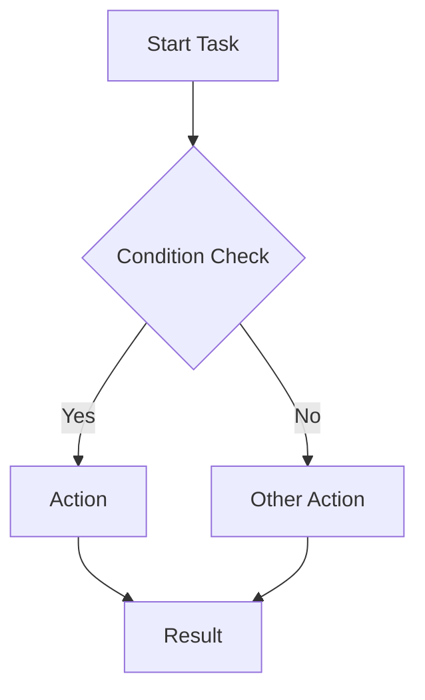

# VitePress Mermaid Renderer

An interactive Mermaid diagram renderer plugin for VitePress. With this package, Mermaid diagrams defined in your Markdown will be displayed with interactive features such as zooming, fullscreen viewing, and panning.

## Features

- 🔍 Zoom in/out
- 🔄 Navigate on diagram (panning)
- 📋 Copy diagram code
- 📏 Reset view
- 🖥️ Fullscreen viewing
- 🎨 Design compatible with VitePress themes

## Installation

```bash
npm install vitepress-mermaid-renderer mermaid
```

or

```bash
yarn add vitepress-mermaid-renderer mermaid
```

## Usage

### VitePress configuration

Add the following configuration to your `.vitepress/config.ts` file:

```typescript
import { defineConfig } from "vitepress";
import { vitepressMermaidPlugin } from "vitepress-mermaid-renderer";

export default defineConfig({
	// ... other configurations
	markdown: {
		config: (md) => {
			vitepressMermaidPlugin(md, {
				// optional configuration
				theme: "default",
				securityLevel: "loose",
				startOnLoad: false,
			});
		},
	},
});
```

### Integrate with your VitePress theme

In your `.vitepress/theme/index.ts` file:

```typescript
import DefaultTheme from "vitepress/theme";
import { setupMermaidPlugin } from "vitepress-mermaid-renderer";

export default {
	...DefaultTheme,
	enhanceApp({ app }) {
		setupMermaidPlugin(app);
	},
};
```

### Usage in Markdown

````markdown
# Diagram Examples


````

## How It Works

When the page loads, the plugin automatically detects any Mermaid code blocks (with language set to `mermaid`) and renders them as interactive diagrams. The diagrams include controls for:

- Zooming in and out
- Panning by dragging
- Resetting the view
- Fullscreen mode
- Copying the diagram code

## Customization

You can customize certain features with plugin options:

```typescript
vitepressMermaidPlugin(md, {
	theme: "default", // or 'dark', 'forest', etc.
	securityLevel: "loose", // Mermaid security level
	startOnLoad: false, // Let the plugin handle initialization
});
```

## Contributing

You can contribute by submitting pull requests or reporting issues.

## Testing Locally

Before publishing, you can test this package locally using one of these methods:

### Method 1: Using npm link

From the package directory:

```bash
# Build the package
npm run build

# Create a global link
npm link
```

From your test project:

```bash
# Link to the package
npm link vitepress-mermaid-renderer
```

### Method 2: Using npm pack

From the package directory:

```bash
# Build the package
npm run build

# Create a tarball
npm pack
```

This will create a file like `vitepress-mermaid-renderer-1.0.0.tgz`. Then, from your test project:

```bash
# Install the local package
npm install /path/to/vitepress-mermaid-renderer-1.0.0.tgz
```

### Method 3: Using yalc (recommended)

First, install yalc globally:

```bash
npm install -g yalc
```

From the package directory:

```bash
# Build the package
npm run build

# Publish to local yalc store
yalc publish
```

From your test project:

```bash
# Add the package from yalc store
yalc add vitepress-mermaid-renderer
```

After making changes to the package:

```bash
# From the package directory
npm run build
yalc push
```

This automatically updates all projects where you added the package.
