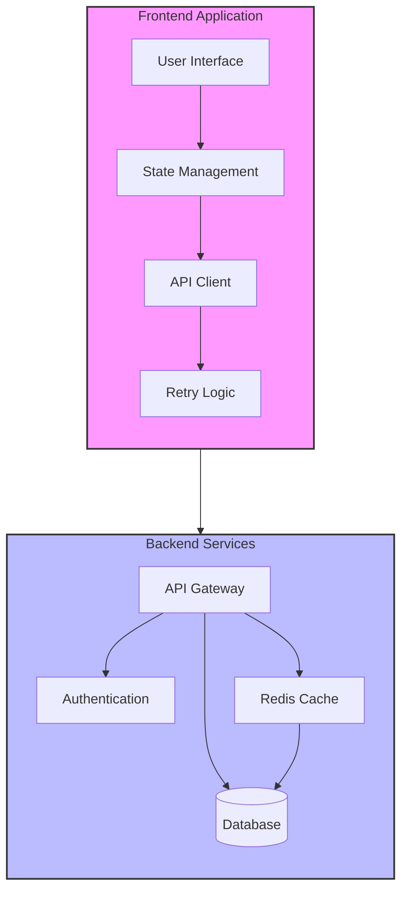
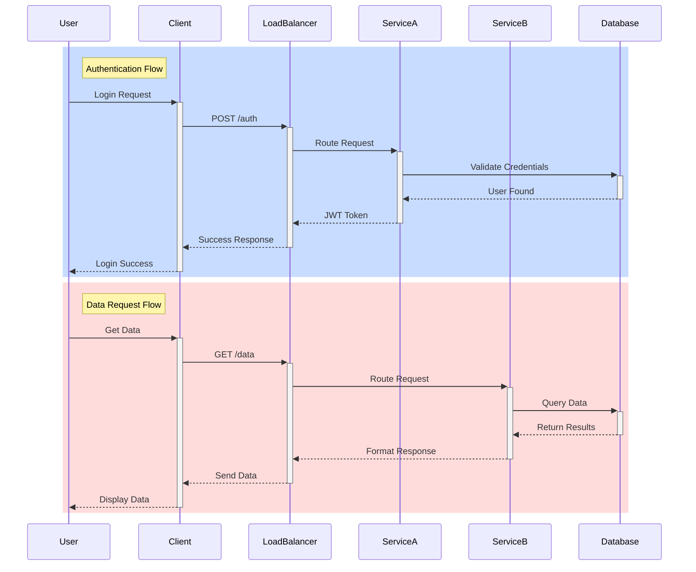
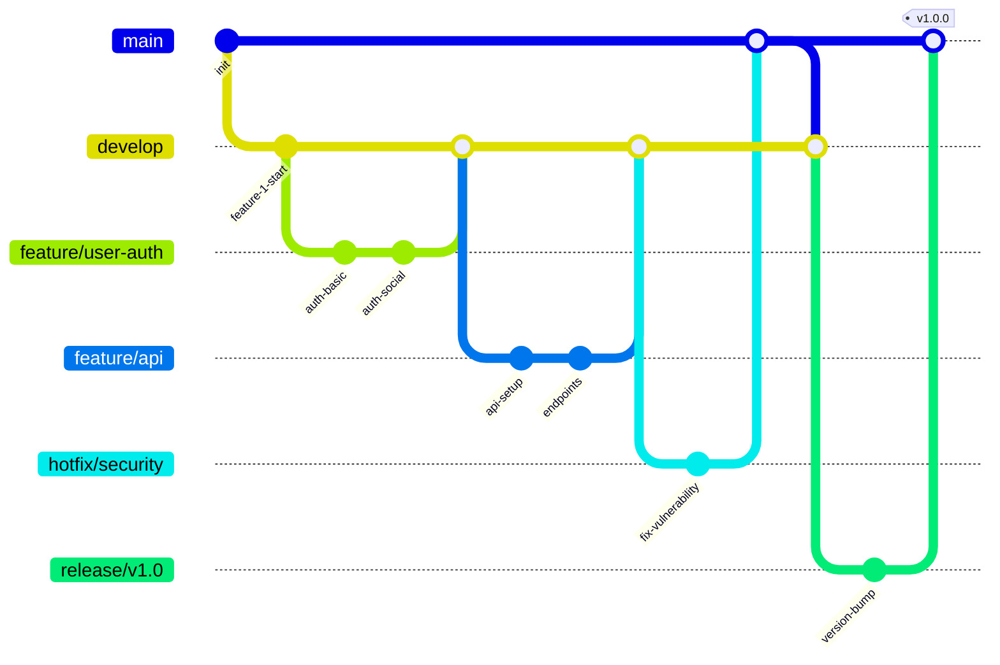
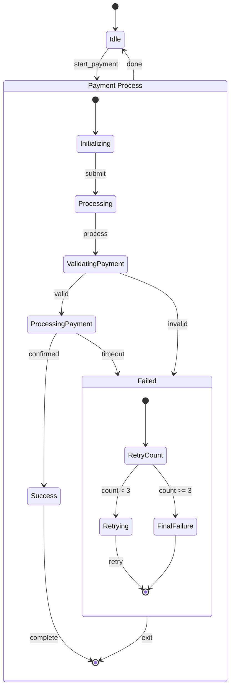
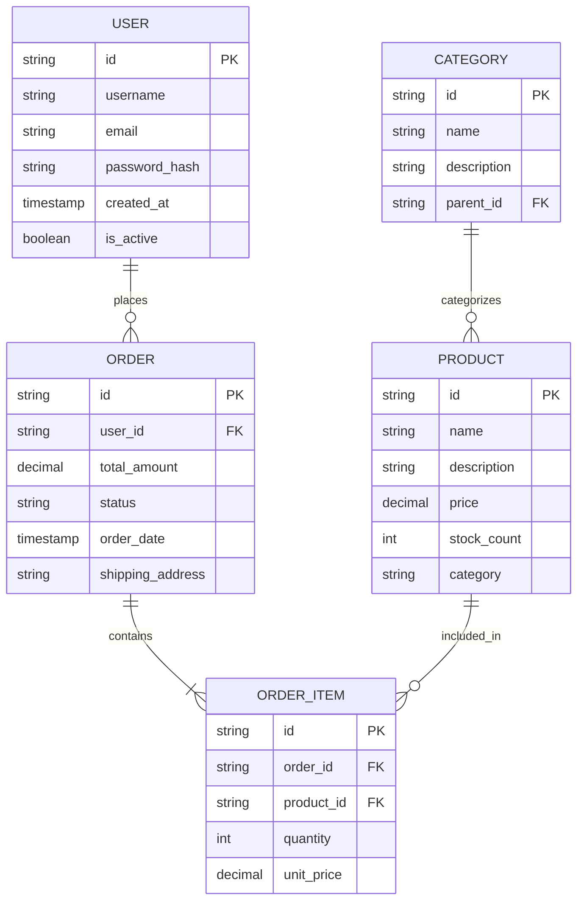
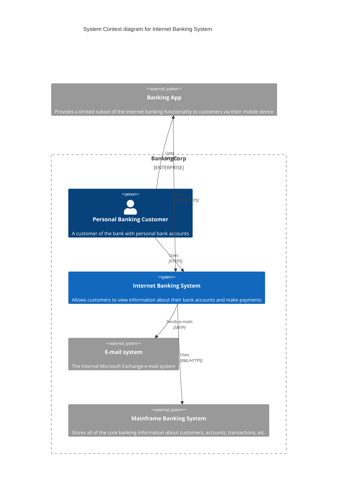

# Advanced Mermaid Examples

This page demonstrates more advanced Mermaid diagrams with advanced features and real-world use cases.

## Advanced Flowchart with Subgraphs

## Advanced Sequence Diagram with Activation and Notes

## Advanced Git Graph

## Advanced State Machine

## Advanced ER Diagram with Relationships

## Advanced C4 Diagram

