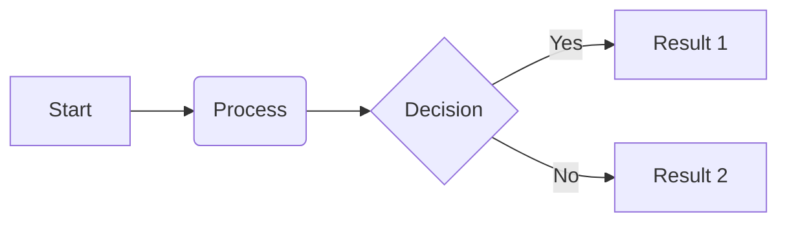
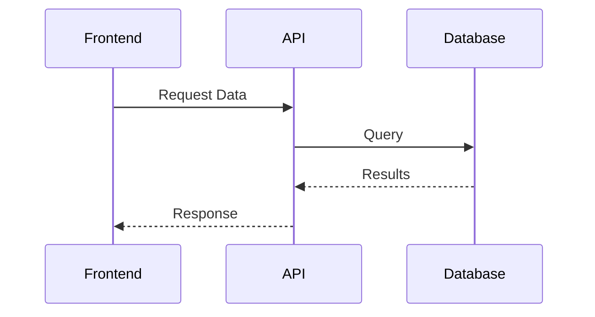
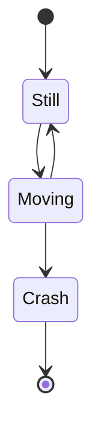
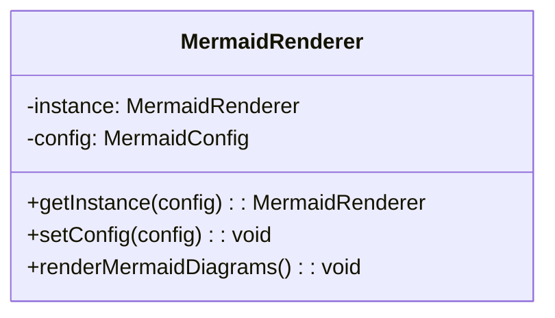
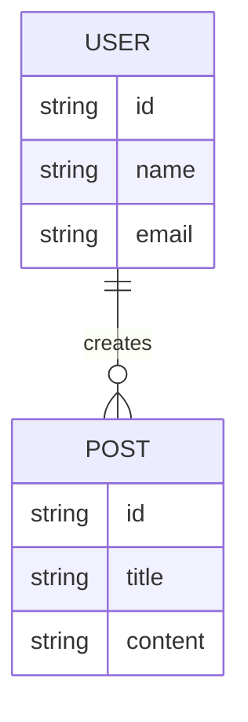
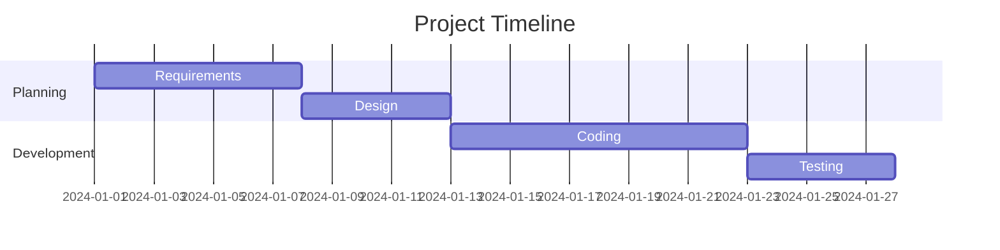
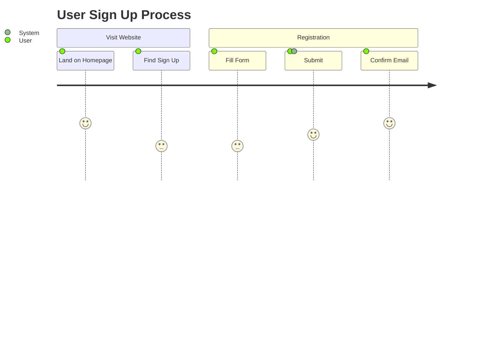

# Basic Examples

This page demonstrates various types of Mermaid diagrams with interactive controls. Each diagram can be:

- 🔍 Zoomed in/out
- 🖱️ Panned by dragging
- 🔄 Reset to original view
- 🖥️ Viewed in fullscreen
- 📋 Code can be copied with one click

## Flowchart

## Sequence Diagram

## State Diagram

## Class Diagram

## Entity Relationship

## Gantt Chart

## Journey Diagram

