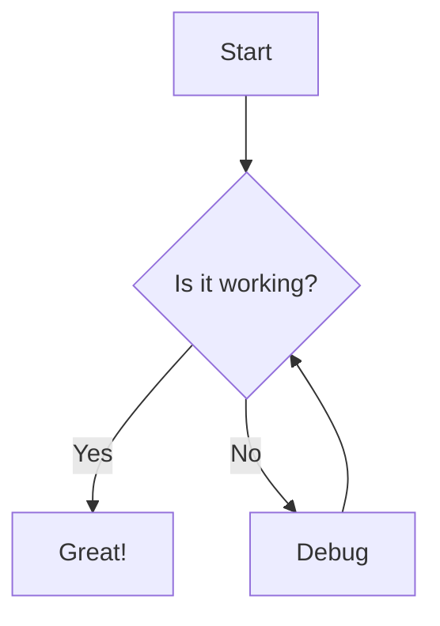
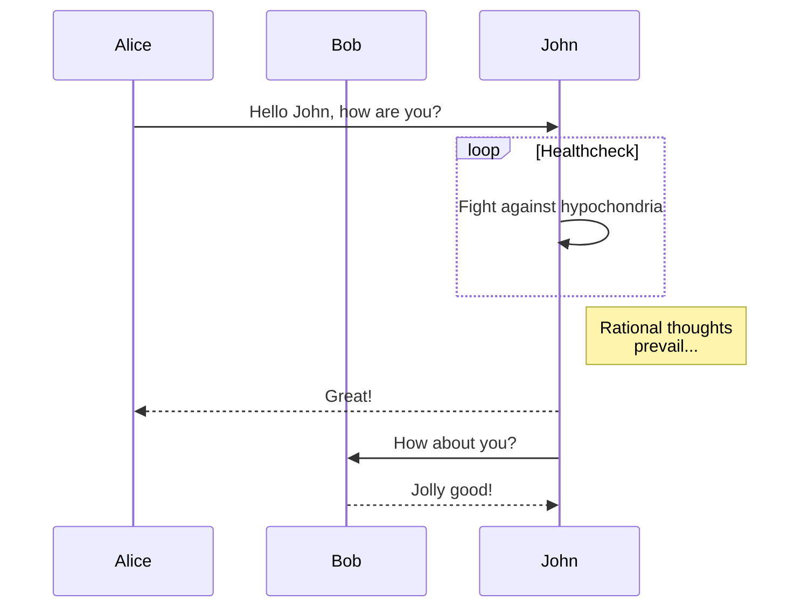
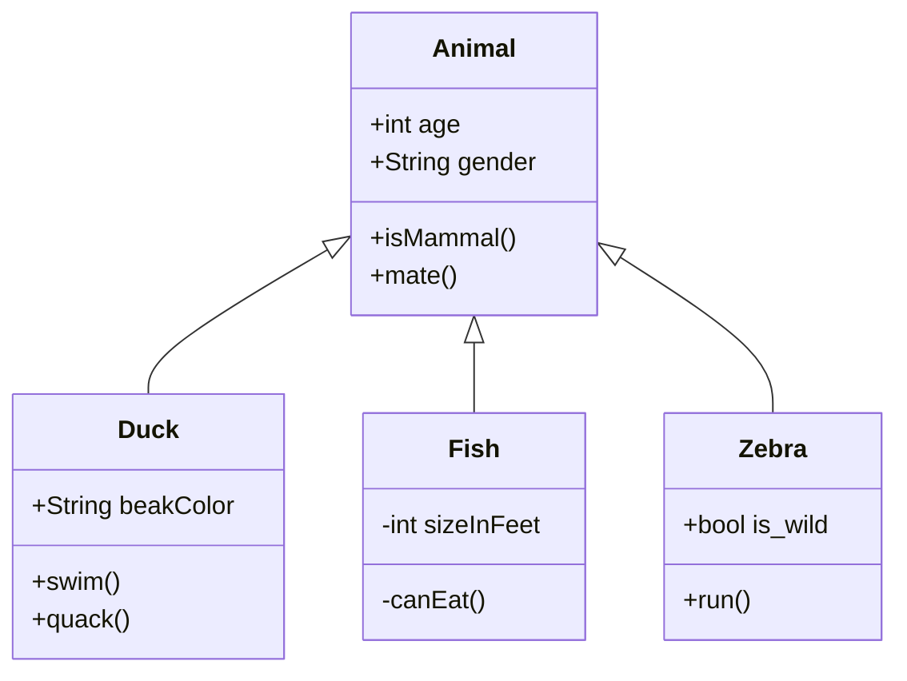
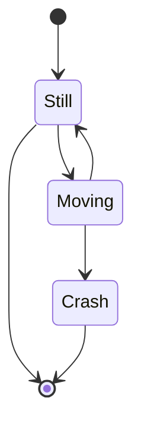
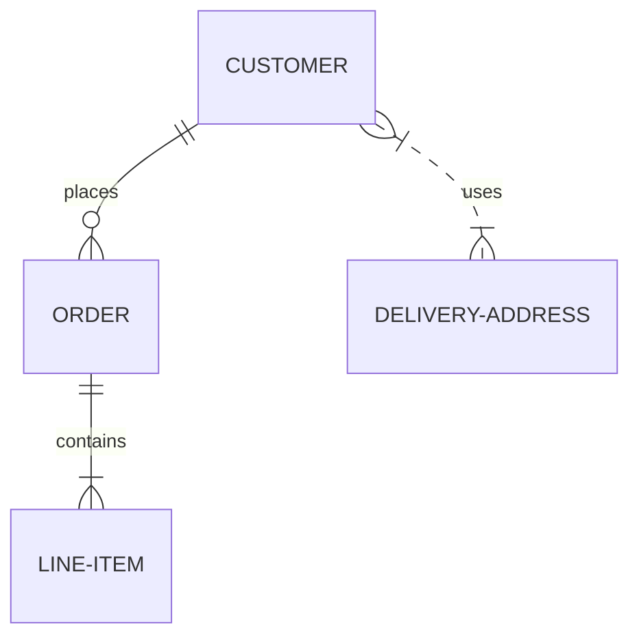
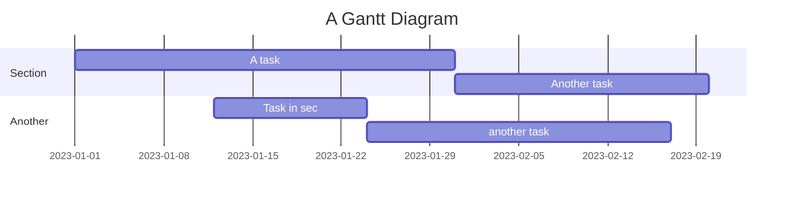
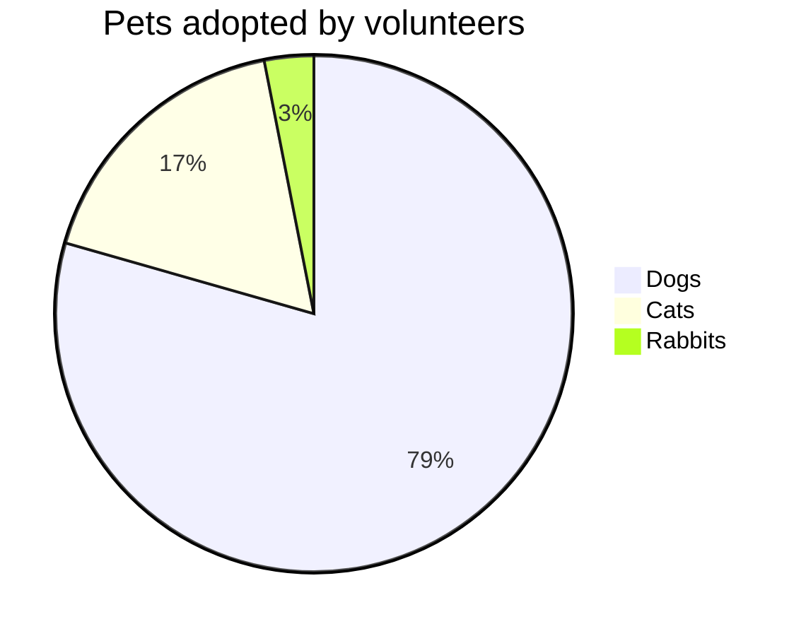
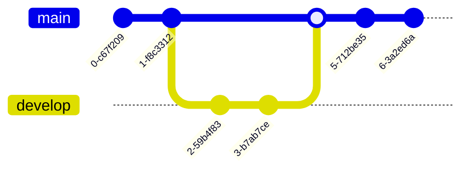
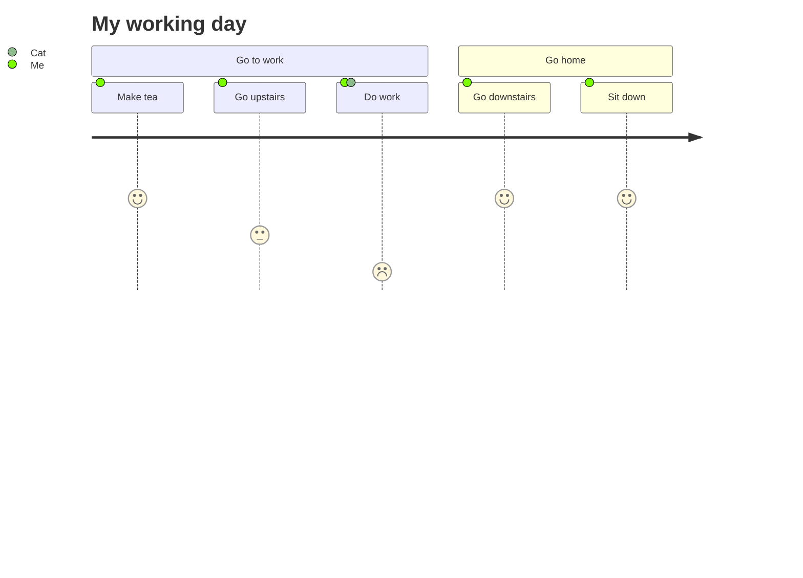
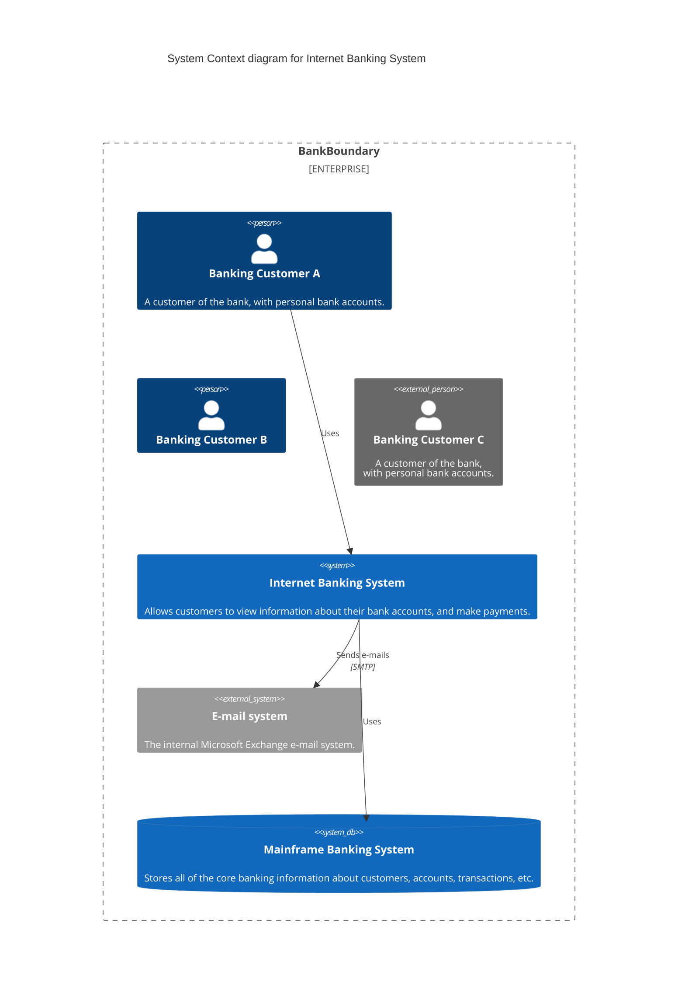

# Markdown Examples

This page contains examples of various Markdown elements that you can use in your VitePress site.

## Mermaid Diagrams

Here are several examples:

### 1. Flowchart

**Input**

**Output**

### 2. Sequence Diagram

**Input**

**Output**

### 3. Class Diagram

**Input**

**Output**

### 4. State Diagram

**Input**

**Output**

### 5. Entity Relationship Diagram

**Input**

**Output**

### 6. Gantt Chart

**Input**

**Output**

### 7. Pie Chart

**Input**

**Output**

### 8. Git Graph

**Input**

**Output**

### 9. User Journey

**Input**

**Output**

### 10. C4 Diagram

**Input**

**Output**

