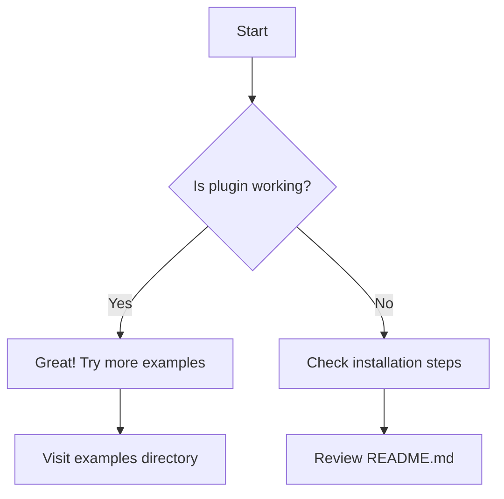

# Installation Test

This page contains a simple Mermaid diagram to verify your installation is working correctly.

## Basic Flowchart

If you can see an interactive diagram above with zoom and pan controls, the installation was successful!

## Next Steps

1. Check out more examples in the `examples/` directory
2. Read the documentation in the `guide/` directory
3. Try creating your own diagrams!
